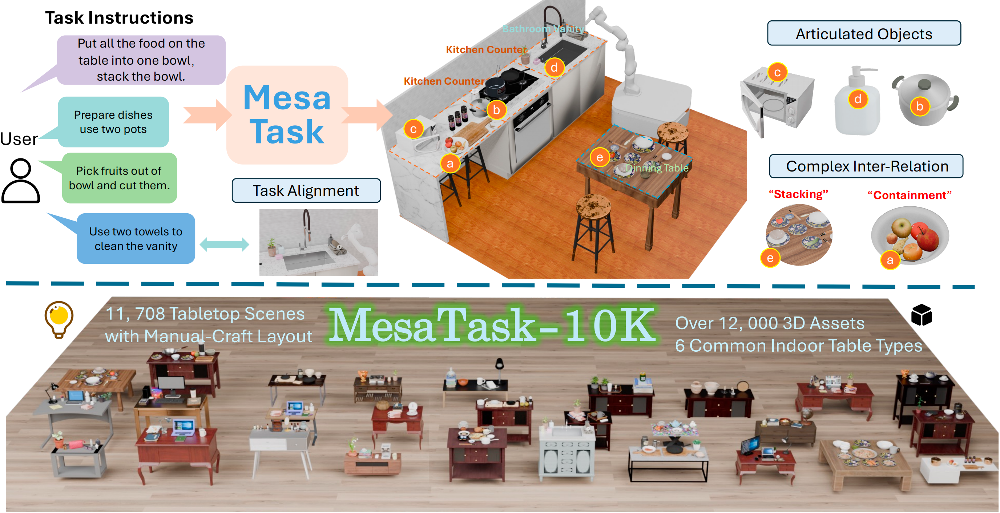

<h2 align="center"<strong>MesaTask: Towards Task-Driven Tabletop Scene Generation via 3D Spatial Reasoning</strong></h2>

<p align="center">
<a href='https://jinkun-hao.github.io/' target='_blank'>Jinkun Hao</a><sup>1*</sup>,
<a href='#' target='_blank'>Naifu Liang</a><sup>2*</sup>,
<a href='https://scholar.google.com/citations?user=hYXbJgcAAAAJ&hl=zh-CN' target='_blank'>Zhen Luo</a><sup>3,4*</sup>,
<a href='https://sheldontsui.github.io/' target='_blank'>Xudong Xu</a><sup>2‡</sup>,
<a href='#' target='_blank'>Weipeng Zhong</a><sup>2</sup>, <br>
<a href='https://yiranran.github.io/' target='_blank'>Ran Yi</a><sup>1</sup>,
<a href='#' target='_blank'>Yichen Jin</a><sup>5</sup>,
<a href='https://zhaoyanglyu.github.io/' target='_blank'>Zhaoyang Lyu</a><sup>2</sup>,
<a href='https://www.sustech.edu.cn/en/faculties/zhengfeng.html' target='_blank'>Feng Zheng</a><sup>4</sup>,
<a href='https://dmcv.sjtu.edu.cn/people/' target='_blank'>Lizhuang Ma</a><sup>1✉️</sup>,
<a href='https://oceanpang.github.io/' target='_blank'>Jiangmiao Pang</a><sup>2</sup>
</p>

<p align="center">
<sup>1</sup>Shanghai Jiao Tong University, <sup>2</sup>Shanghai AI Laboratory, <sup>3</sup>SII, <br>
<sup>4</sup>Southern University of Science and Technology, <sup>5</sup>Peking University
</p>

<p align="center">
* equal contribution, ‡ project lead, ✉️ corresponding author
</p>

<p align="center"><strong><span style="color: #ff0000;">NeurIPS 2025 Spotlight</span></strong></p>

<div align="center">
    <a href='https://arxiv.org/abs/2509.10813'></a> &nbsp;
    <a href='https://huggingface.co/datasets/InternRobotics/MesaTask-10K'></a> &nbsp;
    <a href='https://mesatask.github.io/'></a> &nbsp;
</div>

<p align="center">
    
</p>

## 💡 Abstract

The ability of robots to interpret human instructions and execute manipulation tasks necessitates the availability of task-relevant tabletop scenes for training.
However, traditional methods for creating these scenes rely on time-consuming manual layout design or purely randomized layouts, which are limited in terms of plausibility or alignment with the tasks.
In this paper, we formulate a novel task, namely task-oriented tabletop scene generation, which poses significant challenges due to the substantial gap between high-level task instructions and the tabletop scenes.
To support research on such a challenging task, we introduce **MesaTask-10K**, a large-scale dataset comprising approximately 10,700 synthetic tabletop scenes with **manually crafted layouts** that ensure realistic layouts and intricate inter-object relations.
To bridge the gap between tasks and scenes, we propose a **Spatial Reasoning Chain** that decomposes the generation process into object inference, spatial interrelation reasoning, and scene graph construction for the final 3D layout.
We present **MesaTask**, an LLM-based framework that utilizes this reasoning chain and is further enhanced with DPO algorithms to generate physically plausible tabletop scenes that align well with given task descriptions.
Exhaustive experiments demonstrate the superior performance of MesaTask compared to baselines in generating task-conforming tabletop scenes with realistic layouts.


## TODO
- ✅ Release MesaTask-10k layout dataset
- ✅ Release inference code
- [ ] Release training code and training dataset
- [ ] Release sim-ready scene generation pipeline


## Getting Started

This section provides a quick start guide to set up the environment and run the demo. The following steps will guide you through the installation of the required dependencies, downloading the pretrained models, and preparing the datasets.

### Prepare Environment
1. Create and activate conda environment
```bash
# Create conda environment with Python 3.10
conda create -n MesaTask python=3.10
conda activate MesaTask
```

2. Install other requirements
```bash
# Install PyTorch
pip install torch==2.6.0 torchvision==0.21.0 torchaudio==2.6.0

# Install PyTorch3D
pip install "git+https://github.com/facebookresearch/pytorch3d.git"

# Install remaining requirements
pip install -r requirements.txt
```
3. Download [Blender](https://download.blender.org/release/Blender4.3/). We test our code on blender-4.3.2
```bash
wget https://download.blender.org/release/Blender4.3/blender-4.3.2-linux-x64.tar.xz
tar -xvJf blender-4.3.2-linux-x64.tar.xz
```


## MesaTask-10K Dataset
### Layout Data & MesaTask model
We host our dataset on [Hugging Face](https://huggingface.co/datasets/InternRobotics/MesaTask-10K/). The current version of the layout only contains 3D assets in GLB format. The layout version with URDF ([Partnet Mobaility](https://sapien.ucsd.edu/browse)) assets will be released soon.

The Dataset structure should be as below
```shell
MesaTask-10K/
|-- MesaTask_model
|-- Asset_annotation.json
|-- sbert_text_features.pkl
|-- Assets_library/                 
  |-- {uid}.glb                      
  |-- ...
|-- Layout_info/                   
  |-- bathroom_vanity/
    |-- bathroom_vanity_0000/              
      |-- front.png
      |-- layout.json
    |-- bathroom_vanity_0001/
    |-- ...
  |-- coffee_table/
  |-- dining_table/
  |-- dressing_table/
  |-- kitchen_counter/   
  |-- office_table/   
```

### Visualize the tabletop scene and get the 3D scene file.
```bash
cd dataset

python vis_single.py path/to/layout.json --output_dir vis_data

# python vis_single.py MesaTask-10K/Layout_info/office_table/office_table_0001/laout.json --output_dir vis_data
```


## Inference
Our MesaTask model is  on [Hugging Face](https://huggingface.co/datasets/InternRobotics/MesaTask-10K/tree/main/MesaTask_model)

MesaTask provides a two-step inference pipeline:

1. Generate task information from task instruction
2. Generate 3D scene layout and render the scene from task information

### 1. Task Information Generation

First, generate task information from a task description and table type:

```bash
python get_task_info.py \
    --task_name "Organize books and magazines on the table" \
    --table_type "Nightstand" \
    --api_key "your_api_key" \
    --model "gpt-4o" \
    --output_dir "output"
```

- Create a new task folder (e.g., `output/task_001/`)
- Save the information to `task_info.json` in the task folder

### 2. Scene Generation and Rendering

Then, generate and render the 3D scene based on the task information:

```bash
python inference.py \
    --input_file output/task_001/task_info.json \
    --mesatask_model_path path/to/model \
    --rendering
```
#### (Optional) Physical Optimization for Post Process

```bash
# Prepare .obj format 3D asset for optimization use
python tools/layoutopt/glb2obj.py \
    --glb_dir ./MesaTask-10K/Assets_library \
    --obj_dir ./MesaTask-10K/Assets_library_obj \
    --max_workers 16

# Inference process include physical_optimization
python inference.py \
    --input_file output/task_001/task_info.json \
    --mesatask_model_path ./MesaTask-10K/MesaTask_model \
    --physical_optimization \
    --rendering
```


The output structure will be:
```bash
output/task_001/
├── task_info.json # Task information
└── scene_001/
├── scene_layout.txt # Generated scene layout
├── scene_processed_scene.json # Processed scene with object retrieval
├── scene_reconstructed_bpy.glb # 3D scene file
├── rendered_views/ # Basic rendered views
├── optimized_scene/ # (optional)
│ ├── scene_optimized.json
│ ├── scene_optimized_reconstructed_bpy.glb
│ └── rendered_views/
└── scene_retrieval_results.json # Object retrieval details
```


## 📜 Citation

If you find this work useful, please consider citing our paper:

```bash


```

## 📚 License

This work is licensed under a Apache License.


